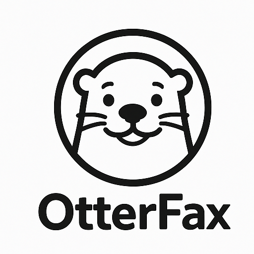

<p align="center">
  
</p>

# 📠 OtterFax

**OtterFax** is a whimsical-yet-secure document transmission service for those who believe business communication should be **encrypted, efficient, and slightly damp**. Designed with **marine life sensibilities** and **government-grade security**, OtterFax brings faxing into the 21st century—*playfully*.

---

## 🌊 Product Vision

**OtterFax** reimagines faxing through the lens of aquatic friendliness, privacy-forward technology, and nostalgic bureaucracy. Whether you're a coastal non-profit, a maritime lawyer, or just a whimsical soul tired of PDFs pretending to be progress, OtterFax delivers.

> “Because sometimes, the only thing between you and compliance is a highly trained digital otter.”

---

## 🛟 Core Features

| Feature | Description |
|--------|-------------|
| 📑 **Send/Receive Digital Faxes** | Upload or receive documents via secure portal |
| 🦦 **Otter Signature Mode** | Apply verified, animated otter paw print to digitally sign docs |
| 🔐 **End-to-End Encryption** | AES-256 + TLS 1.3 encryption for all transmissions |
| 📬 **Fax-to-Email Gateway** | Receive faxes directly in your inbox, otter-stamped and indexed |
| 🧼 **Shred After Reading** | Auto-deletes sensitive transmissions after TTL expires |
| 🛡️ **Audit Trail + Watermarking** | Immutable logs + otter-shaped watermark to ensure authenticity |
| 🎨 **Custom Cover Pages** | Choose from aquatic themes (kelp forest, sea cave, municipal aquarium) |

---

## 🔧 Technical Stack

- **Frontend:** React + Tailwind (with ripple transitions)
- **Backend:** Node.js + Express
- **Storage:** Encrypted S3 buckets (or ocean-themed namespaced object store)
- **Authentication:** OAuth2 + OtterPrint™ Biometric Tokens (beta)
- **PDF Parsing/Faxing Engine:** `pdf-lib`, `twilio-fax`
- **Encryption:** AES-256 with zero-knowledge key handling
- **Database:** PostgreSQL + Audit Logging

---

## 🔐 Compliance & Security

- ✅ HIPAA-Ready  
- ✅ GDPR Compliant  
- ✅ Fax Beast Act of 1994 Compliant *(not real, but we’re ready anyway)*

---

## 🎯 Target Users

- 🧾 Environmental NGOs with legacy fax requirements  
- 🏛️ Maritime lawyers and bureaucrats  
- 🧜‍♀️ Sea-themed coworking collectives  
- 💼 Startups who fax ironically, but securely  

---

## 🗓️ Roadmap

### ✅ MVP
- Secure fax submission & delivery
- Otter-themed fax cover generator
- Email + web inbox
- End-to-end encryption
- Logging & watermarking

### 🔮 Future Milestones
- OtterFax Mobile App (iOS & Android)
- Real-time fax tracking: “Your otter is swimming…”
- Otter-to-Otter encrypted chat overlay
- Fax NFT archival (god help us)

---

## 💸 Funding & Support

OtterFax is currently seeking aquatic-aligned capital partners who believe that **secure document transmission doesn’t have to be boring**.

### We’re Looking For:
- Pre-seed / Seed funding for biometric paw authentication & global fax nodes
- Strategic advisors from secure messaging, marine non-profits, or telephony
- Access to fax-heavy industries looking for absurd but secure alternatives

> “Slack made work chat fun. OtterFax makes legal faxing tolerable. The sea is calling.”

---

## 💌 Call for Beta Testers

We're recruiting early adopters who:
- Still send faxes (voluntarily or otherwise)
- Love sea creatures
- Believe in privacy with a wink

Join the **OtterFax Alliance**—where your documents swim securely through the digital kelp.

---

## 🧜‍♂️ License & Community

MIT Licensed and community-led with support from the *Undersea Bureau of WhimsyTech*. PRs welcome—please include at least one 🦦 emoji in your commit messages.

---

## 📁 Repo Overview

```bash
OtterFax/
├── README.md
├── LICENSE
├── frontend/
│   ├── public/
│   └── src/
│       ├── components/
│       └── assets/icons/
├── backend/
├── docs/
│   └── OtterFax.md
└── .gitignore
```

---

> 🦦 OtterFax – "Because regular faxing is dry and insecure."
